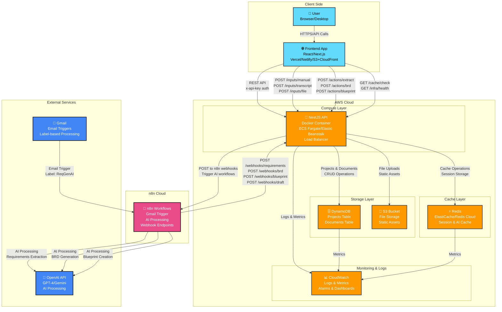

# Deployment Architecture - ReqGenAI

This document outlines the deployment architecture for the ReqGenAI system, showing how components are distributed across different environments and cloud providers.

## Deployment Overview



## Infrastructure Components

### AWS Cloud Services

#### Compute Layer
- **ECS Fargate** or **Elastic Beanstalk**
  - Docker container hosting NestJS API
  - Auto-scaling based on CPU/memory usage
  - Load balancer for high availability
  - Environment: Production, Staging, Development

#### Storage Layer
- **DynamoDB**
  - Projects table: Project metadata and status
  - Documents table: Requirements, BRDs, blueprints, drafts
  - Global Secondary Indexes for efficient querying
  - On-demand billing for variable workloads

- **S3 Bucket**
  - File uploads and attachments
  - Static assets and documentation
  - Versioning and lifecycle policies
  - CloudFront CDN for global distribution

#### Cache Layer
- **ElastiCache (Redis)**
  - Session management
  - AI processing result caching
  - Rate limiting and temporary data
  - Multi-AZ deployment for high availability

#### Monitoring & Observability
- **CloudWatch**
  - Application logs and metrics
  - Custom dashboards and alarms
  - Performance monitoring
  - Cost tracking and optimization

### n8n Cloud
- **Workflow Management**
  - Gmail trigger for email processing
  - AI-powered document generation
  - Webhook endpoints for result delivery
  - Workflow versioning and backup

### Frontend Deployment
- **Vercel/Netlify** (Recommended)
  - Serverless deployment
  - Global CDN
  - Automatic SSL certificates
  - Git-based deployments

- **Alternative: S3 + CloudFront**
  - Static website hosting
  - Custom domain configuration
  - Manual deployment process

## Security Considerations

### API Security
- API key authentication for all endpoints
- HTTPS/TLS encryption for all communications
- CORS configuration for frontend access
- Rate limiting and DDoS protection

### Data Security
- DynamoDB encryption at rest and in transit
- S3 bucket encryption and access policies
- Redis AUTH and TLS encryption
- Environment variable management

### Network Security
- VPC configuration for backend services
- Security groups and NACLs
- Private subnets for database access
- WAF for web application protection

## Scaling Strategy

### Horizontal Scaling
- ECS Fargate auto-scaling based on metrics
- DynamoDB on-demand capacity
- Redis cluster mode for high availability
- CDN for static content distribution

### Performance Optimization
- Redis caching for frequently accessed data
- DynamoDB query optimization
- Connection pooling for database access
- Async processing for long-running tasks

## Deployment Process

### Development Environment
```bash
# Local development
npm run start:dev
docker-compose up -d redis dynamodb-local
```

### Staging Environment
```bash
# Deploy to staging
docker build -t reqgenai:staging .
aws ecs update-service --cluster staging --service reqgenai
```

### Production Environment
```bash
# Deploy to production
docker build -t reqgenai:latest .
aws ecs update-service --cluster production --service reqgenai
```

## Monitoring & Alerting

### Key Metrics
- API response times and error rates
- DynamoDB read/write capacity utilization
- Redis memory usage and hit rates
- Container CPU and memory usage

### Alerts
- High error rates (>5%)
- Database connection failures
- Cache miss rates above threshold
- Container health check failures

This deployment architecture ensures high availability, scalability, and security for the ReqGenAI system across different environments.
