# Low-Level Design (LLD) - ReqGenAI

This document provides a detailed low-level design view of the ReqGenAI system architecture using class diagrams to show module relationships, data entities, and dependencies.

## System Architecture Overview

```mermaid
classDiagram
    %% Controllers Layer
    class InputsController {
        +createManual(dto: ManualInputDto)
        +createTranscript(dto: TranscriptInputDto)
        +createFile(dto: FileInputDto)
    }
    
    class ActionsController {
        +extract(projectId: string, dto: ActionRequestDto)
        +brd(projectId: string, dto: ActionRequestDto)
        +blueprint(projectId: string, dto: ActionRequestDto)
    }
    
    class WebhooksController {
        +requirements(dto: RequirementsWebhookDto)
        +brd(dto: BrdWebhookDto)
        +blueprint(dto: BlueprintWebhookDto)
        +draft(dto: DraftWebhookDto)
    }
    
    class CacheController {
        +check(hash: string)
        +get(key: string)
        +set(key: string, value: any)
        +delete(key: string)
    }
    
    %% Services Layer
    class InputsService {
        +createInput(source: string, content: string, sourceDetail?: string)
    }
    
    class ActionsService {
        +extract(projectId: string, metadata?: Record~string, any~)
        +brd(projectId: string, metadata?: Record~string, any~)
        +blueprint(projectId: string, metadata?: Record~string, any~)
    }
    
    class WebhooksService {
        +saveDocument(projectId: string, type: string, content: any, sourceHash?: string)
    }
    
    class ProjectsService {
        +createProject(projectId: string, source: string, content: string)
        +createMinimalProject(projectId: string)
    }
    
    class CacheService {
        +get~T~(key: string) Promise~T | null~
        +set(key: string, value: any, ttlSeconds?: number)
        +del(key: string)
        +clear()
    }
    
    %% Repository Layer
    class DynamoRepository {
        +putProject(projectId: string, attributes: any)
        +putDocument(projectId: string, type: string, documentId: string, content: string)
    }
    
    %% External Services
    class N8NService {
        +extractionUrl: string
        +brdUrl: string
        +blueprintUrl: string
    }
    
    class RedisClient {
        +connect()
        +get(key: string)
        +set(key: string, value: string, ttl?: number)
        +del(key: string)
        +disconnect()
    }
    
    %% Data Entities
    class Project {
        +projectId: string
        +source: string
        +status: string
        +totalDocuments: number
        +createdAt: string
        +updatedAt: string
    }
    
    class Document {
        +projectId: string
        +documentId: string
        +type: string
        +content: string
        +createdAt: string
        +updatedAt: string
    }
    
    class CacheEntry {
        +key: string
        +value: any
        +ttl: number
        +createdAt: string
    }
    
    %% Storage Systems
    class DynamoDB {
        +ProjectsTable: string
        +DocumentsTable: string
        +putItem(table: string, item: any)
        +getItem(table: string, key: any)
        +query(table: string, keyCondition: any)
    }
    
    class Redis {
        +host: string
        +port: number
        +database: number
        +get(key: string)
        +set(key: string, value: string)
        +del(key: string)
        +flushall()
    }
    
    %% DTOs
    class ManualInputDto {
        +content: string
    }
    
    class TranscriptInputDto {
        +content: string
        +source?: string
    }
    
    class FileInputDto {
        +filename: string
        +text: string
    }
    
    class ActionRequestDto {
        +metadata?: Record~string, any~
    }
    
    class RequirementsWebhookDto {
        +projectId: string
        +requirements: any
        +sourceHash?: string
        +timestamp?: string
    }
    
    class BrdWebhookDto {
        +projectId: string
        +brd: any
        +version?: number
        +sourceHash?: string
        +timestamp?: string
    }
    
    class BlueprintWebhookDto {
        +projectId: string
        +blueprint: any
        +version?: number
        +timestamp?: string
    }
    
    class DraftWebhookDto {
        +projectId: string
        +draft: DraftContent
        +timestamp?: string
    }
    
    class DraftContent {
        +subject: string
        +body: string
    }
    
    %% Relationships - Controllers to Services
    InputsController --> InputsService : uses
    ActionsController --> ActionsService : uses
    WebhooksController --> WebhooksService : uses
    CacheController --> CacheService : uses
    
    %% Relationships - Services to Services
    InputsService --> ProjectsService : uses
    WebhooksService --> ProjectsService : uses
    WebhooksService --> CacheService : uses
    
    %% Relationships - Services to Repositories
    ProjectsService --> DynamoRepository : uses
    WebhooksService --> DynamoRepository : uses
    
    %% Relationships - Services to External Services
    ActionsService --> N8NService : calls via Axios
    CacheService --> RedisClient : uses
    
    %% Relationships - Repositories to Storage
    DynamoRepository --> DynamoDB : stores in
    RedisClient --> Redis : connects to
    
    %% Relationships - DTOs to Controllers
    ManualInputDto --> InputsController : input
    TranscriptInputDto --> InputsController : input
    FileInputDto --> InputsController : input
    ActionRequestDto --> ActionsController : input
    RequirementsWebhookDto --> WebhooksController : input
    BrdWebhookDto --> WebhooksController : input
    BlueprintWebhookDto --> WebhooksController : input
    DraftWebhookDto --> WebhooksController : input
    
    %% Relationships - Entities to Storage
    Project --> DynamoDB : persisted in
    Document --> DynamoDB : persisted in
    CacheEntry --> Redis : cached in
```

## Key Design Patterns

### 1. **Layered Architecture**
- **Controller Layer**: Handles HTTP requests and validation
- **Service Layer**: Contains business logic and orchestration
- **Repository Layer**: Abstracts data access
- **Storage Layer**: External persistence systems

### 2. **Dependency Injection**
- All services and repositories are injected via NestJS DI container
- Promotes loose coupling and testability

### 3. **Data Transfer Objects (DTOs)**
- Strongly typed request/response objects
- Validation using class-validator decorators
- Clear API contracts

### 4. **Repository Pattern**
- Abstracts database operations
- Enables easy testing with mocks
- Centralizes data access logic

### 5. **Service Orchestration**
- Services coordinate between multiple repositories
- Handle business logic and validation
- Manage external service integrations

## Data Flow

1. **Input Processing**: Controllers receive DTOs → Services process → Repositories persist
2. **Action Triggers**: Controllers → Services → External n8n APIs
3. **Webhook Processing**: External n8n → Controllers → Services → Repositories + Cache
4. **Cache Operations**: Controllers → Services → Redis client

## External Dependencies

- **AWS DynamoDB**: Primary data persistence
- **Redis**: Caching layer for performance
- **n8n Workflows**: AI processing and document generation
- **Axios**: HTTP client for external API calls

This design ensures scalability, maintainability, and clear separation of concerns across the ReqGenAI system.
