# Sequence Diagrams - ReqGenAI

This document provides sequence diagrams showing the end-to-end workflows for the ReqGenAI system, illustrating the interactions between different components.

## End-to-End Workflow Sequence

```mermaid
sequenceDiagram
    participant User as 👤 User
    participant Frontend as 🌐 Frontend
    participant Backend as 🐳 Backend (NestJS)
    participant N8N as 🔄 n8n Cloud
    participant DynamoDB as 🗄️ DynamoDB
    participant Redis as ⚡ Redis

    Note over User, Redis: ReqGenAI Complete Workflow

    %% Manual Input Flow
    rect rgb(240, 248, 255)
        Note over User, Redis: 1. Manual Input Submission
        User->>Frontend: Submit manual input
        Frontend->>Backend: POST /inputs/manual<br/>{ content: "..." }
        Backend->>DynamoDB: putProject(projectId, source, status)
        Backend->>DynamoDB: putDocument(projectId, "RAW_INPUT", content)
        Backend-->>Frontend: { success: true, projectId }
        Frontend-->>User: Input submitted successfully
    end

    %% Requirements Extraction Flow
    rect rgb(240, 255, 240)
        Note over User, Redis: 2. Requirements Extraction
        User->>Frontend: Click "Extract Requirements"
        Frontend->>Backend: POST /actions/extract/:projectId<br/>{ metadata: {...} }
        Backend->>N8N: POST to N8N_EXTRACTION_URL<br/>{ projectId, metadata }
        Backend-->>Frontend: { success: true, status: "processing" }
        Frontend-->>User: Extraction started
        
        Note over N8N: AI Processing Requirements
        N8N->>N8N: Process input with AI
        N8N->>Backend: POST /webhooks/requirements<br/>{ projectId, requirements, sourceHash }
        Backend->>DynamoDB: putDocument(projectId, "REQUIREMENTS", requirements)
        Backend->>Redis: set("ai:hash:" + sourceHash, { projectId, documentId, type })
        Backend-->>N8N: { success: true, documentId }
    end

    %% BRD Generation Flow
    rect rgb(255, 248, 240)
        Note over User, Redis: 3. BRD Generation
        User->>Frontend: Click "Generate BRD"
        Frontend->>Backend: POST /actions/brd/:projectId<br/>{ metadata: {...} }
        Backend->>N8N: POST to N8N_BRD_URL<br/>{ projectId, metadata }
        Backend-->>Frontend: { success: true, status: "processing" }
        Frontend-->>User: BRD generation started
        
        Note over N8N: AI Processing BRD
        N8N->>N8N: Generate BRD with AI
        N8N->>Backend: POST /webhooks/brd<br/>{ projectId, brd, version, sourceHash }
        Backend->>DynamoDB: putDocument(projectId, "BRD", brd)
        Backend->>Redis: set("ai:hash:" + sourceHash, { projectId, documentId, type })
        Backend-->>N8N: { success: true, documentId }
    end

    %% Blueprint Generation Flow
    rect rgb(248, 240, 255)
        Note over User, Redis: 4. Blueprint Generation
        User->>Frontend: Click "Generate Blueprint"
        Frontend->>Backend: POST /actions/blueprint/:projectId<br/>{ metadata: {...} }
        Backend->>N8N: POST to N8N_BLUEPRINT_URL<br/>{ projectId, metadata }
        Backend-->>Frontend: { success: true, status: "processing" }
        Frontend-->>User: Blueprint generation started
        
        Note over N8N: AI Processing Blueprint
        N8N->>N8N: Generate Blueprint with AI
        N8N->>Backend: POST /webhooks/blueprint<br/>{ projectId, blueprint, version }
        Backend->>DynamoDB: putDocument(projectId, "BLUEPRINT", blueprint)
        Backend-->>N8N: { success: true, documentId }
    end

    %% Draft Email Flow
    rect rgb(255, 240, 240)
        Note over User, Redis: 5. Draft Email Generation
        User->>Frontend: Click "Draft Email"
        Frontend->>Backend: POST /actions/draft/:projectId<br/>{ metadata: {...} }
        Backend->>N8N: POST to N8N_DRAFT_URL<br/>{ projectId, metadata }
        Backend-->>Frontend: { success: true, status: "processing" }
        Frontend-->>User: Draft generation started
        
        Note over N8N: AI Processing Draft
        N8N->>N8N: Generate Email Draft with AI
        N8N->>Backend: POST /webhooks/draft<br/>{ projectId, draft }
        Backend->>DynamoDB: putDocument(projectId, "DRAFT", draft)
        Backend-->>N8N: { success: true, documentId }
    end

    %% Cache Check Flow
    rect rgb(240, 255, 255)
        Note over User, Redis: 6. Cache Check (Optional)
        User->>Frontend: Check processing status
        Frontend->>Backend: GET /cache/check?hash=sourceHash
        Backend->>Redis: get("ai:hash:" + sourceHash)
        Redis-->>Backend: { projectId, documentId, type } or null
        Backend-->>Frontend: { hit: boolean, data?: {...} }
        Frontend-->>User: Status update
    end
```

## Gmail Integration Workflow

```mermaid
sequenceDiagram
    participant Gmail as 📧 Gmail
    participant N8N as 🔄 n8n Cloud
    participant Backend as 🐳 Backend (NestJS)
    participant DynamoDB as 🗄️ DynamoDB
    participant Redis as ⚡ Redis

    Note over Gmail, Redis: Gmail Trigger Workflow

    %% Gmail to n8n Flow
    rect rgb(240, 248, 255)
        Note over Gmail, Redis: 1. Gmail Trigger
        Gmail->>N8N: Email received (Label: ReqGenAI)
        N8N->>N8N: Extract email content
        N8N->>N8N: Normalize email to JSON format
        N8N->>Backend: POST /webhooks/requirements<br/>{ projectId, requirements, sourceHash }
        Backend->>DynamoDB: putProject(projectId, "email", status)
        Backend->>DynamoDB: putDocument(projectId, "RAW_INPUT", emailContent)
        Backend->>DynamoDB: putDocument(projectId, "REQUIREMENTS", requirements)
        Backend->>Redis: set("ai:hash:" + sourceHash, { projectId, documentId, type })
        Backend-->>N8N: { success: true, documentId }
    end

    %% Auto-trigger BRD Generation
    rect rgb(240, 255, 240)
        Note over Gmail, Redis: 2. Auto BRD Generation
        N8N->>N8N: Auto-trigger BRD generation
        N8N->>Backend: POST /webhooks/brd<br/>{ projectId, brd, version, sourceHash }
        Backend->>DynamoDB: putDocument(projectId, "BRD", brd)
        Backend->>Redis: set("ai:hash:" + sourceHash, { projectId, documentId, type })
        Backend-->>N8N: { success: true, documentId }
    end
```

## Error Handling Sequence

```mermaid
sequenceDiagram
    participant User as 👤 User
    participant Frontend as 🌐 Frontend
    participant Backend as 🐳 Backend (NestJS)
    participant N8N as 🔄 n8n Cloud
    participant DynamoDB as 🗄️ DynamoDB

    Note over User, DynamoDB: Error Handling Workflow

    %% API Key Validation Error
    rect rgb(255, 240, 240)
        Note over User, DynamoDB: 1. Authentication Error
        User->>Frontend: Submit request
        Frontend->>Backend: POST /inputs/manual<br/>(missing x-api-key)
        Backend-->>Frontend: 401 Unauthorized<br/>{ error: "API key is required" }
        Frontend-->>User: Authentication failed
    end

    %% n8n Service Error
    rect rgb(255, 248, 240)
        Note over User, DynamoDB: 2. n8n Service Error
        User->>Frontend: Click "Extract Requirements"
        Frontend->>Backend: POST /actions/extract/:projectId
        Backend->>N8N: POST to N8N_EXTRACTION_URL
        N8N-->>Backend: 500 Internal Server Error
        Backend-->>Frontend: { success: false, error: "Failed to initiate extraction process" }
        Frontend-->>User: Processing failed
    end

    %% Database Error
    rect rgb(248, 240, 255)
        Note over User, DynamoDB: 3. Database Error
        User->>Frontend: Submit input
        Frontend->>Backend: POST /inputs/manual
        Backend->>DynamoDB: putProject(projectId, source, status)
        DynamoDB-->>Backend: Connection timeout
        Backend-->>Frontend: 500 Internal Server Error<br/>{ error: "Database connection failed" }
        Frontend-->>User: Service temporarily unavailable
    end
```

## Key Workflow Characteristics

### 1. **Asynchronous Processing**
- User actions trigger immediate responses
- AI processing happens asynchronously in n8n
- Results are delivered via webhooks

### 2. **State Management**
- Project state tracked in DynamoDB
- Cache used for performance optimization
- Source hash mapping for deduplication

### 3. **Error Resilience**
- Graceful error handling at each step
- User-friendly error messages
- Retry mechanisms for transient failures

### 4. **Data Flow**
- Input → Processing → Storage → Cache
- Webhook-based result delivery
- Real-time status updates via cache

### 5. **Security**
- API key authentication required
- Input validation at all entry points
- Secure data transmission (HTTPS/TLS)

This sequence diagram illustrates the complete end-to-end workflow of the ReqGenAI system, showing how user interactions flow through the system to generate comprehensive project documentation.
